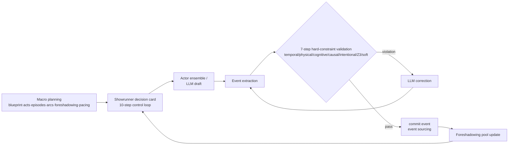

# StoryOS · Story Engine

**[简体中文](README.md) · [English](README.en.md)**

> Core philosophy: **The LLM is demoted from "author" to "language layer"; consistency is the job of a structured world-simulation layer.**
> A visual, intervene-able AI long-form novel writing desk: 315 genres × 20-layer worldview wizard × macro planning × chapter generation pipeline. Every step is visible, editable, and rollback-able.

> ⚠️ **Single-user deployment**: The engine/kernel is a process-level singleton — concurrent multi-user access is not supported (state would leak between users). Designed for local self-hosting or personal Docker deployment.

## Quick Start

**Windows**: double-click `start.bat`
**macOS / Linux**: `bash start.sh`

The script automatically: creates a `.venv` virtualenv → detects China network (uses Aliyun mirror) → installs dependencies → starts the server.

> The first launch auto-downloads an embedding model (BAAI/bge-small-zh-v1.5, ~100 MB via HF-Mirror);
> subsequent launches are near-instant. Embedding uses FastEmbed (ONNX Runtime) — no PyTorch required.

The first launch runs in **Mock demo mode** (offline script, zero API cost, all features explorable).
To write with a real LLM: **left sidebar "Settings" → LLM card**: pick a provider (Moonshot / Kimi Code / GLM / DeepSeek / OpenAI) → paste API key → test connection → save. Takes effect immediately, no restart needed; check "write back to .env" to persist across restarts.

Manual start (without the script):

```bash
python -m venv .venv
source .venv/bin/activate        # Windows: .venv\Scripts\activate
pip install -r requirements.txt
python -m uvicorn backend.main:app --port 8111
# open http://localhost:8111
```

Then: **left sidebar "Card Draw"** → search a genre (315 available) → pick a worldview skeleton → worldview + language wizard → character archetypes → macro planning (streamed) → confirm start → the writing desk begins chapter 1.

> ℹ️ The UI is currently in Chinese. The codebase, API, and architecture are language-agnostic; an i18n contribution would be welcome.

### Docker

```bash
docker build -t storyos .
docker run -p 8111:8111 storyos
# open http://localhost:8111
```

The image ships with a demo project (`yupei`, a suspense sample). For a clean state, delete `/app/data/projects/yupei` inside the container. LLM key is best configured on the settings page after launch, or inject via `-e STORY_ENGINE_LLM_API_KEY=...`.

## What is this

A runnable implementation of the core loop from the *Story Engine blueprint*:

```
Macro planning (6 components) → Showrunner decision card (10-step control loop)
  → Actor ensemble / LLM draft generation → event extraction → 7-step hard-constraint validation
  → violation found → LLM correction → commit event (event sourcing) → foreshadowing pool update
```

- **Consistency is structurally guaranteed**: a 7-step validation pipeline (temporal / physical / cognitive / causal / intentional / Z3 SMT / soft judgment) automatically detects and repairs violations.
- **Macro planning first**: story blueprint / act structure (7 templates) / episode synopses / arc milestones / foreshadowing layout / pacing curve, generated via WebSocket streaming, with current-episode context auto-injected per chapter.
- **Everything is an event**: generation / word-edit / memo / diagnosis / rollback all enter the event stream — replayable and auditable. One directory per project (independent SQLite); zip export = distribution.
- **Pluggable genre system**: 315 genre packs (29 hand-crafted + 286 taxonomy-generated) × 12 cultures × 98 material packs (skills / evaluation / language / world rules / character archetypes).

## Key Features

<p align="center">
  <br>
  <sub>Card Draw: search 315 genres → worldview skeleton recommendation</sub>
</p>

| Module | Description |
|---|---|
| Card Draw | 315-genre search/filter/pagination → skeleton recommendation (3-axis affinity) → 20-layer worldview wizard (100 params + 107 cascading predicates) → character archetypes → streamed macro planning → conflict detection C1-C6 |
| Writing Desk | Chapter generation (two-phase: decision card first, then draft) / paragraph ops (edit-word / memo / rewrite / diagnose) / rollback to any point |
| Planning Graph | Macro-plan dashboard: blueprint / act structure / episodes / arcs / foreshadowing / pacing visualization + deviation detection |
| Multi-project | One directory per project, independent DB; create / continue / export zip / import zip |
| Plugins | Browse 98 material packs + 315 genre packs (read-only); skill crystallization training signal |
| Settings | Online LLM config (test-before-save) / self-eval & IR-first toggles / LLM ping |

### Writing Desk

<p align="center">
  <br>
  <sub>Chapter generation + paragraph ops (edit-word / memo / rewrite / diagnose)</sub>
</p>

<p align="center">
  <br>
  <sub>The 10-step Showrunner decision card is shown before drafting — transparent and intervene-able</sub>
</p>

### Planning Graph

<p align="center">
  &nbsp;&nbsp;
  <br>
  <sub>Macro-plan dashboard: blueprint / acts / episodes / arcs / foreshadowing / pacing visualization + deviation detection</sub>
</p>

## LLM Integration

Any provider compatible with OpenAI's `/chat/completions` works. Online config (recommended): pick a provider on the settings page and enter the key. You can also use `.env` (copy `.env.example`):

```bash
STORY_ENGINE_LLM_MODE=openai
STORY_ENGINE_LLM_BASE_URL=https://api.moonshot.cn/v1
STORY_ENGINE_LLM_API_KEY=sk-your-key
STORY_ENGINE_LLM_MODEL=kimi-k2.6
```

Note: **Kimi Code subscription keys (sk-kimi- prefix) and Moonshot open-platform keys are separate auth systems.** The endpoint must include `/coding/v1` (the client auto-adapts User-Agent and thinking params). For story-writing we recommend Moonshot open-platform general models (pay-as-you-go, no special requirements).

## Local Development

```bash
pip install -r requirements.txt

# Backend (:8111, also serves the built frontend)
python -m uvicorn backend.main:app --reload --port 8111

# Frontend dev (optional, hot-reload :3111, proxies /api to :8111 incl. WebSocket)
cd frontend && npm install && npm run dev
# Frontend build: npm run build

# Tests (281 + 74 subtests)
python -m pytest tests/ -q
```

## Architecture

Core loop (generation / checking / correction are three separated channels):



Code organization:

```
story_engine/            Pure-Python core package (no web-framework dependency)
├── kernel/              15 syscalls · Registry (plugins + material packs) · LLMPool · Embedder
├── engine.py            Core-loop orchestrator (generate / check / fix — 3 channels)
├── showrunner/          10-step decision card · CFPG foreshadowing pool · PacingEngine
├── character/           CharacterActor (SOAR + 16-bank memory + persona)
├── narrative/           Layered IR · Fabula/Sjuzhet · bilingual Realizer
├── evaluator/           ProcessGate · Critic parliament · Leader arbiter · best-of-K
├── macro/               Macro-plan generation · templates · cross-layer conflict check C1-C6
├── worldview/           20 layers · 100 params · 107 cascading predicates · 10 skeletons
├── meta/                Meta-Generator · card draw · genre taxonomy (315) · codegen
└── plugins/             genres×315 · cultures×12 · packs×98
backend/main.py          FastAPI endpoints (thin web layer; business logic lives in story_engine)
frontend/                Vue 3 SPA (10 views, editorial dual-theme)
data/projects/<name>/    One directory per project (story.db + chapters.json + config)
```

## Contributing

See [CONTRIBUTING.md](CONTRIBUTING.md). PRs are welcome — the core package (`story_engine/`) is fully test-covered and decoupled from the web layer, making it easy to extend.

## Logging

loguru end-to-end: console INFO + `logs/story_engine.log` DEBUG (rotated daily).
Each chapter generation carries a `trace_id` (e.g. `ch1-a3f2b1c9`); full LLM prompt/response is persisted to disk — grep the trace_id to pull the complete generation chain for that chapter.

## License

MIT (see [LICENSE](LICENSE))
