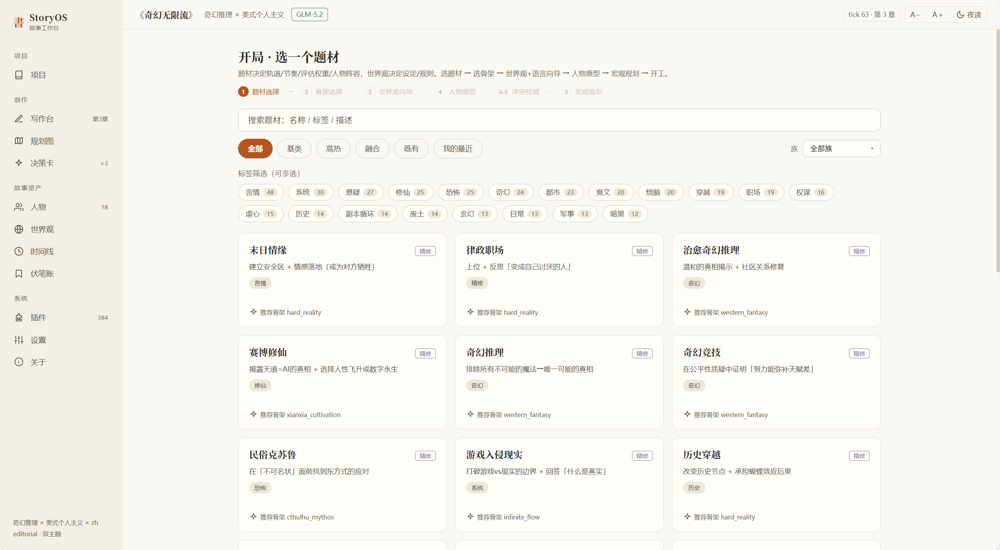
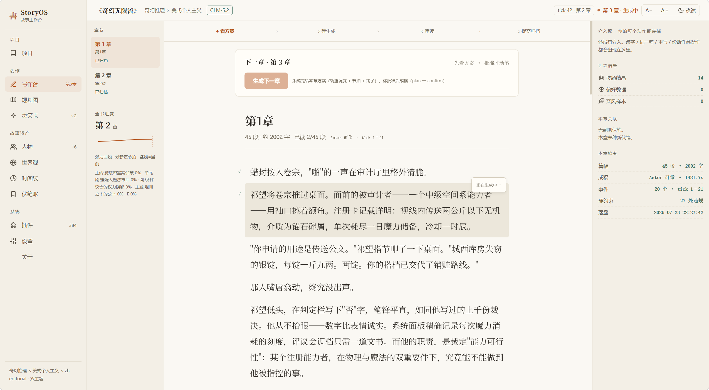
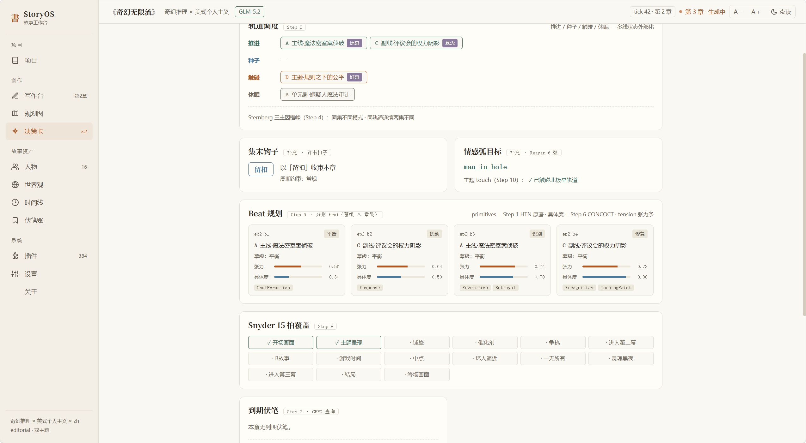
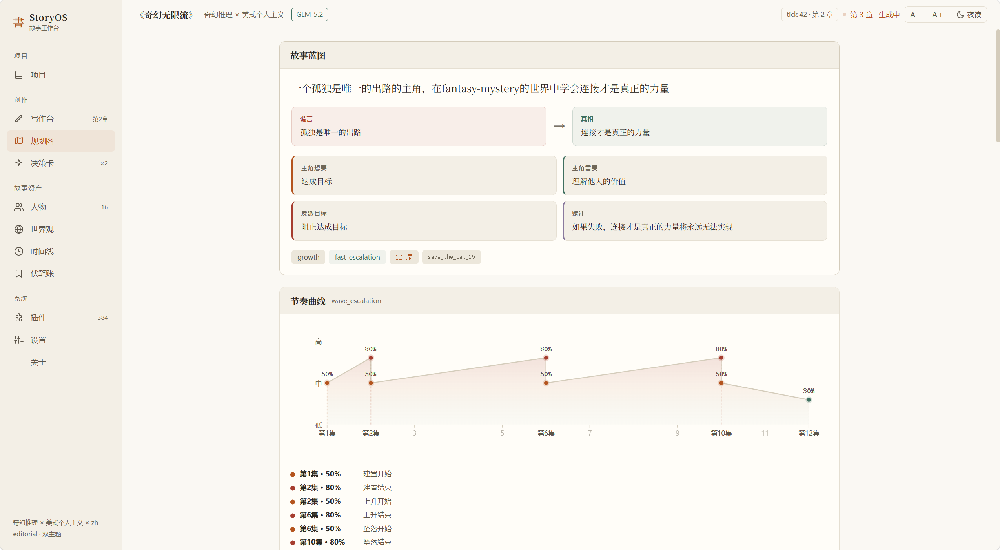
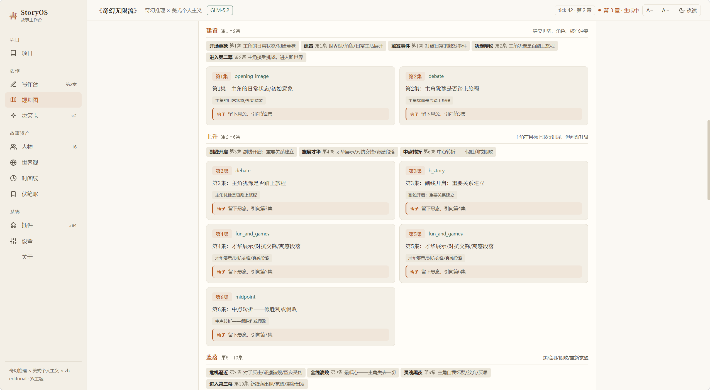
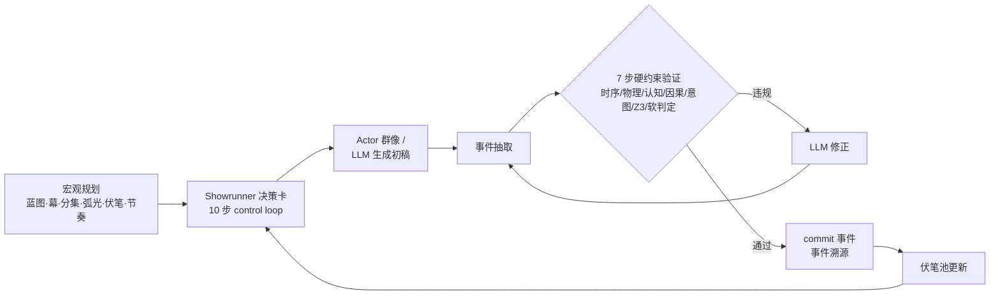

# StoryOS · 故事引擎

**[简体中文](README.md) · [English](README.en.md)**

> 核心哲学：**LLM 从"作者"降级为"语言层"，一致性的责任交给结构化世界模拟层。**
> 一个可视化、可干预的 AI 长篇小说写作台：315 题材 × 20 层世界观向导 × 宏观规划 × 章节生成管线，每一步都能看见、能改、能回滚。

> ⚠️ **单用户部署**：本系统是个人写作台，engine/kernel 为进程级单例，不支持多人同时在线（会串数据）。适合本地自用或 Docker 自部署。

## 快速上手

**Windows**：双击 `start.bat`
**macOS / Linux**：`bash start.sh`

脚本会自动：创建 `.venv` 虚拟环境 → 检测国内网络走阿里源 → 安装依赖 → 启动服务。

> 首次启动会自动下载 embedding 模型（BAAI/bge-small-zh-v1.5，约 100 MB，经 HF-Mirror），
> 之后启动是秒级的。Embedding 用 FastEmbed（ONNX Runtime），无需 PyTorch。

首次启动是 **Mock 演示模式**（离线剧本，零 API 成本，全功能可逛）。
要用真实 LLM 写作：**左侧「设置」→ LLM 接入卡**：选 provider（Moonshot / Kimi Code / GLM / DeepSeek / OpenAI 任选）→ 粘贴 API key → 测试连接 → 保存。即时生效，无需重启；勾选「写回 .env」则重启后仍生效。

手动启动（不用脚本）：

```bash
python -m venv .venv
source .venv/bin/activate        # Windows: .venv\Scripts\activate
pip install -r requirements.txt
python -m uvicorn backend.main:app --port 8111
# 打开 http://localhost:8111
```

然后：**左侧「抽卡开局」** → 搜一个题材（315 个：无限流/霸总/规则怪谈/修仙…）→ 选世界观骨架 → 世界观+语言向导 → 人物原型 → 宏观规划（流式生成）→ 确认开工 → 写作台开始写第一章。

### Docker

```bash
docker build -t storyos .
docker run -p 8111:8111 storyos
# 打开 http://localhost:8111
```

镜像内含 yupei 演示项目（公案悬疑样章）；要干净初始状态，删除容器内 `/app/data/projects/yupei` 即可。LLM key 建议启动后在设置页在线配置，也可 `-e STORY_ENGINE_LLM_API_KEY=...` 注入。

## 这是什么

把《Story Engine 工程蓝图》核心循环做成的可运行系统：

```
宏观规划（六组件） → Showrunner 决策卡（10 步 control loop）
  → Actor 群像 / LLM 生成初稿 → 事件抽取 → 7 步硬约束验证
  → 发现违规 → LLM 修正 → commit 事件（事件溯源）→ 伏笔池更新
```

- **一致性是结构保证的**：时序/物理/认知/因果/意图/Z3 SMT/软判定 七步验证管线，违规自动发现、自动修正
- **宏观规划先行**：故事蓝图/幕结构（32 个品类模板，子套路级推荐 + AI 定制结构）/分集梗概/弧光里程碑/伏笔布局/节奏曲线，WebSocket 流式生成，每章自动注入当前集上下文
- **一切都是事件**：生成/改字/记一笔/诊断/回滚全部进事件流，可回放可审计；一项目一目录（独立 SQLite），zip 导出即分发
- **插件化题材体系**：315 个题材包（29 精修 + 286 taxonomy 生成）× 12 文化 × 98 素材包（技能/评估/语言/世界规则/人物原型）

## 主要功能

<p align="center">
  <br>
  <sub>抽卡开局：315 题材搜索 → 世界观骨架推荐</sub>
</p>

| 模块 | 说明 |
|---|---|
| 抽卡开局 | 315 题材搜索/筛选/分页 → 骨架推荐（三轴亲和检测）→ 20 层世界观向导（100 参数 + 107 条级联谓词）→ 人物原型 → 宏观规划流式生成 → 冲突检测 C1-C6 |
| 写作台 | 章节生成（两阶段：先看决策卡再写）/ 段落四操作（改字/记一笔/重写/诊断）/ 回滚到任意时点 |
| 规划图 | 宏观计划 Dashboard：蓝图/幕结构/分集/弧光/伏笔/节奏可视化 + 偏差检测 |
| 多项目 | 一项目一目录独立 DB，项目页开新/续旧/导出 zip/导入 zip |
| 插件 | 98 素材包 + 315 题材包只读浏览，技能结晶训练信号 |
| 设置 | LLM 在线配置（先测后存）/ 自评与 IR-first 开关 / LLM ping |

### 写作台

<p align="center">
  <br>
  <sub>章节生成 + 段落四操作（改字/记一笔/重写/诊断）</sub>
</p>

<p align="center">
  <br>
  <sub>章节生成前先看 Showrunner 10 步决策卡，透明可干预</sub>
</p>

### 规划图

<p align="center">
  &nbsp;&nbsp;
  <br>
  <sub>宏观计划 Dashboard：蓝图 / 幕结构 / 分集 / 弧光 / 伏笔 / 节奏可视化 + 偏差检测</sub>
</p>

## LLM 接入

任何兼容 OpenAI `/chat/completions` 的 provider 均可。在线配置（推荐）：设置页选 provider 填 key 即可。也可走 `.env`（复制 `.env.example`）：

```bash
STORY_ENGINE_LLM_MODE=openai
STORY_ENGINE_LLM_BASE_URL=https://api.moonshot.cn/v1
STORY_ENGINE_LLM_API_KEY=sk-你的key
STORY_ENGINE_LLM_MODEL=kimi-k2.6
```

注意：**Kimi Code 套餐 key（sk-kimi- 前缀）与 Moonshot 开放平台是独立认证体系**，端点必须带 `/coding/v1`（客户端已自动适配 User-Agent 与 thinking 参数）。写故事推荐 Moonshot 开放平台通用模型（按量计费、无特殊要求）。

## 本地开发

```bash
pip install -r requirements.txt

# 后端（:8111，同时托管前端构建产物）
python -m uvicorn backend.main:app --reload --port 8111

# 前端开发（可选，热更新 :3111，代理 /api 到 :8111，含 WebSocket）
cd frontend && npm install && npm run dev
# 前端构建：npm run build

# 测试（281 + 74 subtests）
python -m pytest tests/ -q
```

## 架构速览

核心循环（生成/检查/修正三通道分离）：



代码组织：

```
story_engine/            纯 Python 核心包（不依赖 Web 框架）
├── kernel/              15 syscall · Registry（插件+素材包）· LLMPool · Embedder
├── engine.py            核心循环编排器（生成/检查/修正三通道分离）
├── showrunner/          10 步决策卡 · CFPG 伏笔池 · PacingEngine
├── character/           CharacterActor（SOAR + 16-bank 记忆 + persona）
├── narrative/           分层 IR · Fabula/Sjuzhet · 双语 Realizer
├── evaluator/           ProcessGate · Critic 议会 · Leader 仲裁 · best-of-K
├── macro/               宏观规划生成 · 模板 · 跨层冲突检测 C1-C6
├── worldview/           20 层 100 参数 · 107 谓词级联 · 十骨架
├── meta/                Meta-Generator · 抽卡 · genre taxonomy(315) · codegen
└── plugins/             genres×315 · cultures×12 · packs×98
backend/main.py          FastAPI 端点（薄 Web 层，业务逻辑全在 story_engine 核心包）
frontend/                Vue 3 SPA（10 视图，editorial 双主题）
data/projects/<name>/    一项目一目录（story.db + chapters.json + 配置落盘）
```

## 文档

- `docs/前端自动化测试指引.md` — 前端操作测试（71 个 data-testid）

> 更多背景（设计蓝图、API 契约、拓展挂点）正在整理中，欢迎在 Issues 区提问。

## 日志

loguru 全链路：控制台 INFO + `logs/story_engine.log` DEBUG（按天轮转）。
每章生成带 `trace_id`（如 `ch1-a3f2b1c9`），LLM 调用的完整 prompt/response
全文落盘——grep trace_id 即可拉出该章完整生成链路。

## 致谢

感谢 **凡事皆可** 短剧团队（交流群二维码见应用内左侧导航「关于」页，


